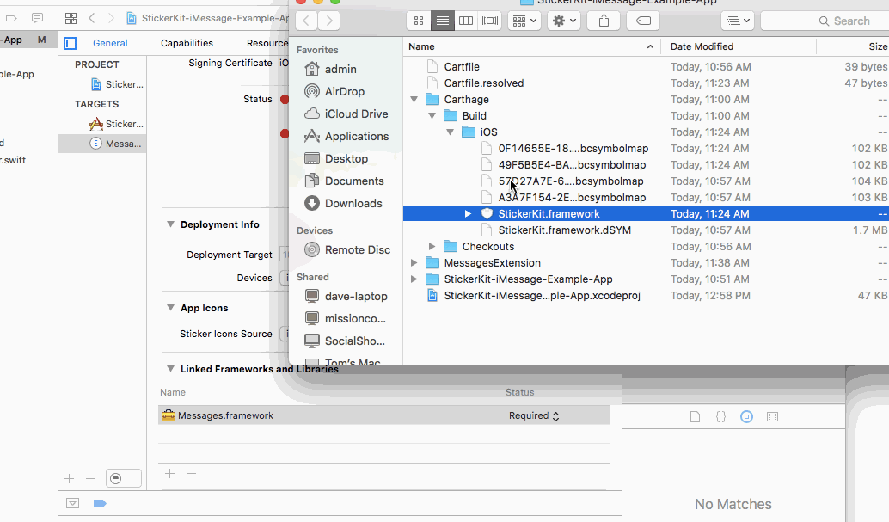
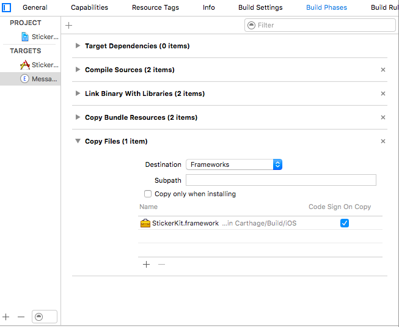
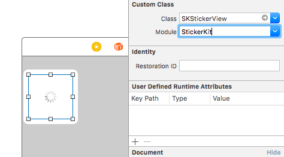

# StickerKit-iOS-SDK

Use this SDK to integrate StickerKit into your iOS Application.

## Installation

StickerKit is available through [Carthage](http://github.com/Carthage/Carthage).

To add StickerKit to your App:

1 - Make sure you have the most recent version of Carthage

```
brew install carthage
```
2 - Create a Cartfile with contents:

```
github “StickerKit/StickerKit-iOS-SDK”
```

3 - Go to your project in Terminal and run:

```
carthage update --platform iOS
```

4 - The StickerKit Framework will be built inside the Carthage > iOS > Build folder. Drag that into your target's 'Linked Frameworks and Libraries'



5 - Finally, go into your target's 'Build Phases' section and in the Copy Files section add StickerKit




## Working with Storyboard

StickerKit contains an extension on MSStickerView, called SKStickerView. It is useful because it comes prebuilt to help you track Analytics on your stickers. Make sure you pick the Module to be StickerKit when using SKStickerView in Storyboard.



## Author

Cory Alder & Daniel Mathews, StickerKit

## License

StickerKit is available under the MIT license. See the LICENSE file for more info.